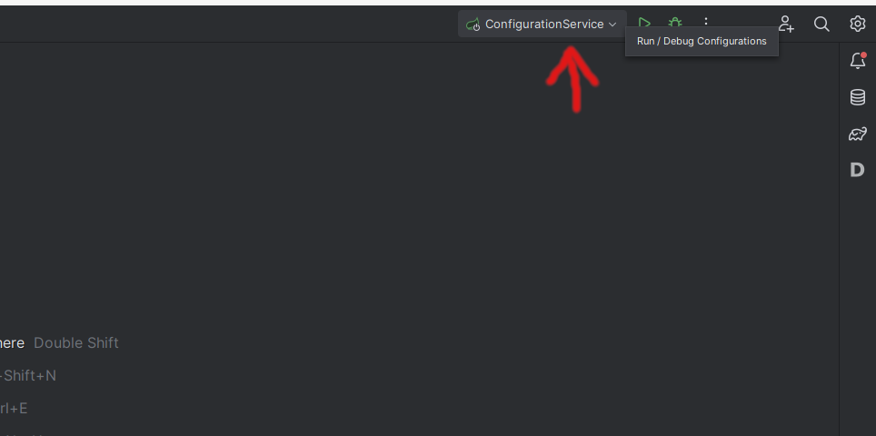
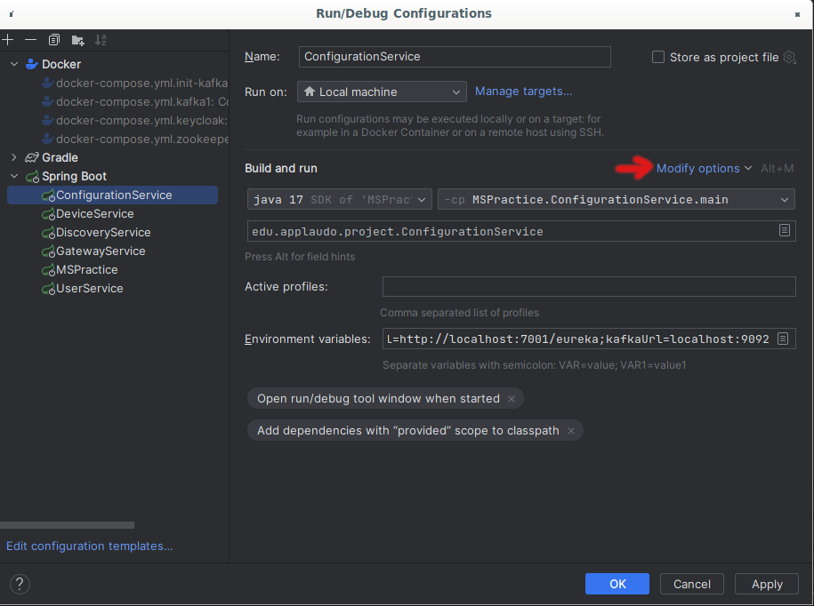
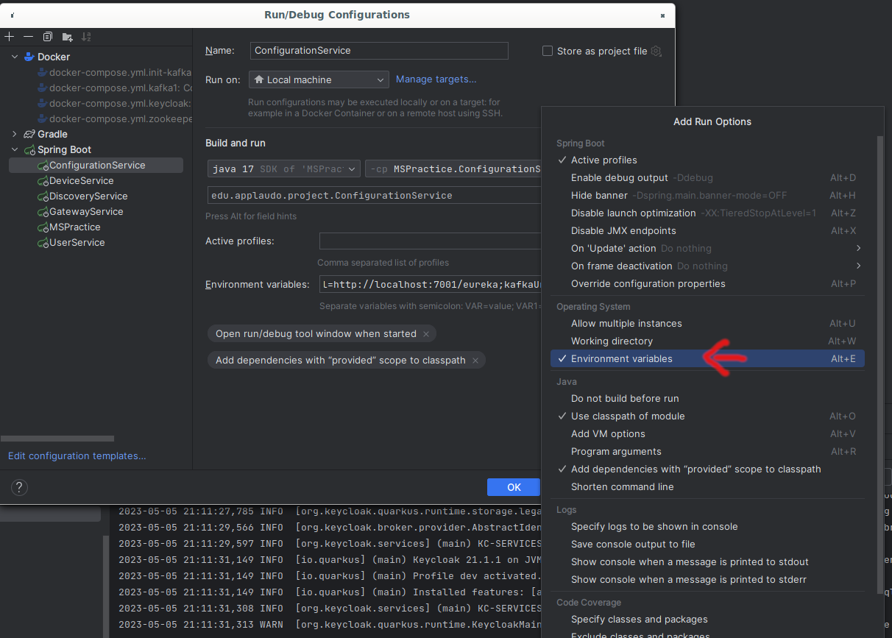
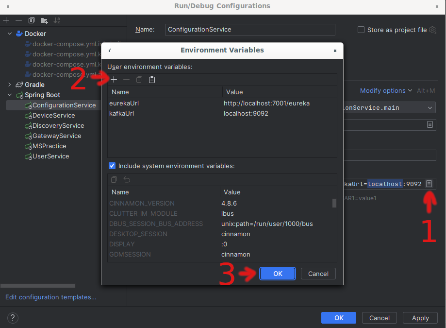

# How To configure environment variables in IntelliJ

## Variables

- EUREKA_URL=http://localhost:7001/eureka
- CONFIG_DATA_PATH=file:///C:\Users\aluis\IdeaProjects\JConf2024-MicroserviceArchitecture\ConfigurationRepository
- KAFKA_URL=http://localhost:9092
- SERVICE_GATEWAY_URL=http://localhost:8010

### Fast way to copy and paste on Intellij

```
CONFIG_DATA_PATH=file:///C:\Users\aluis\IdeaProjects\JConf2024-MicroserviceArchitecture\ConfigurationRepository;EUREKA_URL=http://localhost:7001/eureka;KAFKA_URL=http://localhost:9092;SERVICE_GATEWAY_URL=http://localhost:8010
```

1. Open the Project Configuration 
2. Click on "Modify Options" 
3. Select "Environment variables" 
4. Lick on step 1 and create your variables 

# Notes

Apply this option to **"ConfigurationService"**, **"UserService"**, **"DeviceService"**, **"GatewayService"**, **"
GraphQLService"**