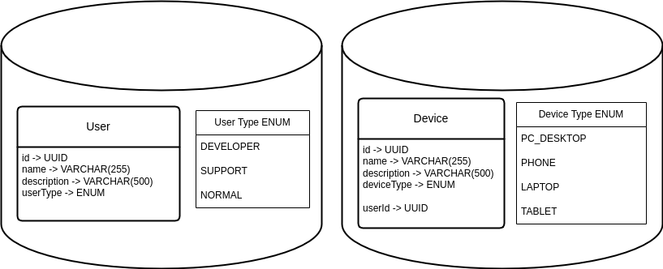
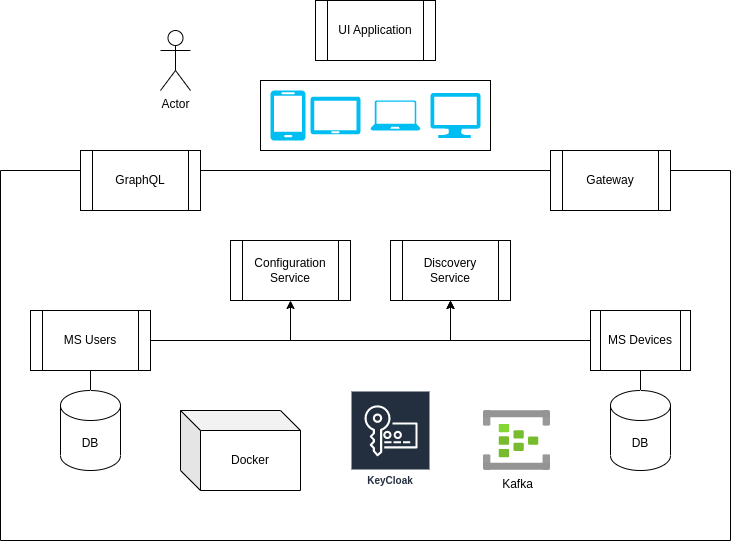
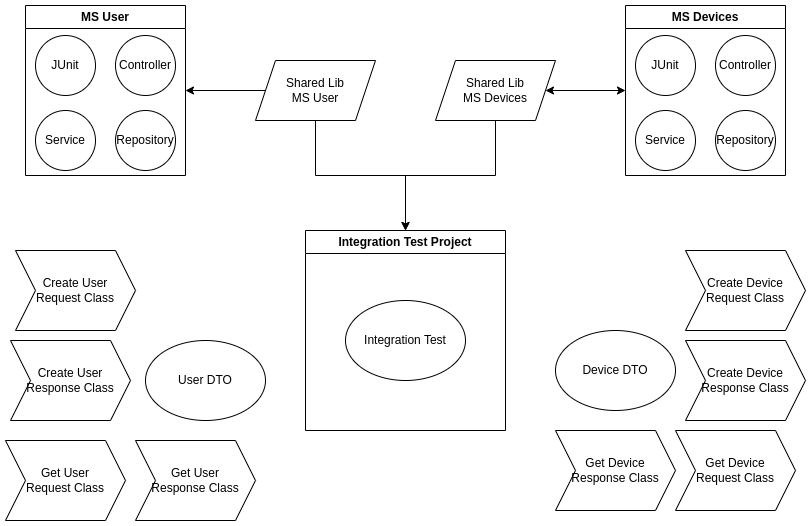

# JConf2024-MicroserviceArchitecture

Project repository to demostrate Microservice Architecture working.

## Deep dive into microservices architecture in Java Spring

Have you had problems implementing microservices? Are some things more complex to solve and do you feel that it is a
waste of resources? Well, come join this talk where we will talk about scaling, implementation and use of this
beautiful architecture in today's applications. See [Deep Dive Into Microservices Architecture In Java Spring PDF](Documentation/presentation/DeepDiveIntoMicroservicesArchitectureInJavaSpring.pdf)

## Description

Carrying out an implementation of this architecture is more complex than you can imagine, the fact of not knowing the
concepts and foundation that compose it, leads to a partial or incomplete implementation, giving rise to problems that
sometimes
In turn, they propose solutions that prevent the benefits of this architecture from being appreciated.

Among the brightest features of micro-services applications; is its scaling (horizontal and vertical),
since these applications scale automatically and on demand, and if the result of their implementation does not give way
to
this particular feature then we are faced with a case of a poor implementation of it.

**The simple fact of not knowing fundamental concepts and/or elements that make up this architecture will lead you to a
chaos and along with that an implementation that will provide more headaches than benefits.**

With this talk, I seek to ensure that whoever decides to implement this type of service-oriented architecture can do so.
in a healthy way and in the correct scenarios, since you cannot always use it due to:

- Application dimensions:
    - Users quantity
    - Costs
- User needs in the application:
    - Type of connections
    - Legal restrictions with data
    - Hardware limitations
- Other factors that will affect development:
    - Code workflow
    - Deployment of the code to environments
    - Team experience (group and individual)
    - Internal team training time
    - Documentation habits

# Español

## Profundizando en la arquitectura de micro-servicios con Java Spring

¿Has tenido problemas implementando micro servicios? ¿Algunas cosas son más complejas de resolver y sientes que es un
desperdicio de recursos? Pues ven a unirte a este charla donde hablaremos del escalado, implementación y uso de esta
hermosa arquitectura en las aplicaciones del hoy día. Ver [Deep Dive Into Microservices Architecture In Java Spring PDF](Documentation/presentation/DeepDiveIntoMicroservicesArchitectureInJavaSpring.pdf)

## Descripción

Realizar una implementación de esta arquitectura es más complejo de lo que se puede imaginar, el hecho de no conocer los
conceptos y fundamento que la componen, te lleva a una implementación parcial o incompleta dando paso a problemas que a
su vez plantean soluciones que evitan que se aprecien las bondades de esta arquitectura.

Entre las características más brillantes de las aplicaciones en micro-servicios; es su escalado (horizontal y vertical),
ya que estas aplicaciones escalan de forma automatizada y a demanda, y si el resultado de su implementación no da paso a
esta característica en particular entonces estamos frente a un caso de una mala implementación de la misma.

**El simple hecho de no conocer conceptos fundamentales y/o elementos que componen esta arquitectura, te llevará a un
caos y junto a eso a una implementación que brindará más dolores de cabeza que ventajas.**

Con esta charla, busco hacer que quien decida implementar este tipo de arquitectura orientada al servicio pueda hacerlo
de una forma saludable y en los escenarios correctos, puesto no siempre puedes usarla debido a:

- Dimensiones de la aplicación:
    - cantidad de usuarios
    - Costos
- Necesidades del usuario en la aplicación:
    - Tipo de conexiones
    - Restricciones de ley con la data
    - Limitaciones de hardware
- Otros factores que afectarán el desarrollo:
    - Flujo de trabajo del código
    - Despliegue del código a los entornos
    - Experiencia del equipo (grupal e individual)
    - Tiempo de entrenamiento interno del equipo
    - Hábitos de documentación
    - ...

# Diagrams

## DB

Entities to use

## Architecture

General viw to understand how user interact

## Project Architecture

Developer view to understand how to build a project

# Business Rules

To define and have a project with a functional objective we have the following rules

- When you create a USER have to create a Device too
- A user exist only when have 1 or more devices
- Report by users of the number of devices (real time cache). See Reports section

# Definitions

- **Common Library**: is a project to share Any default configuration or pattern than we need in our services
- **Shared library**:  is a project than only have DTOs, Request Body, Response Body and any common class can be
  shareable between MS

# Microservice Flows

## Users Microservices

### Get User

Get one user

### List Users

Return an array of Users with pagination

### Create new user

By default, we create a user with a default and basic device

### Edit user

Update basic information of User

### Delete User

When delete a user have to remove the devices too.

## Devices

### Get Device

Get one device

### List Devices

Return an array of devices by user with pagination

### Create device

Create a new device to a specific user.

### Update device

Update basic information from a device (only owner can change it)

### Delete Device

Remove a device and validate user attached to device had another one (return active devices)

## Gateway

### Add device to User

Add a new Device to User

### Delete device to User

Remove a device from User Devices

# Technologies

- [OpenAPI](https://springdoc.org/v2/) (Documentation)
- Gateway (Kong or [Spring Gateway](https://spring.io/guides/gs/gateway/)) (With flows)
- Kafka
    - [Reply Pattern](https://dzone.com/articles/synchronous-kafka-using-spring-request-reply-1)
    - [Retry Pattern](https://www.baeldung.com/spring-retry-kafka-consumer)
- Docker
- Spring Boot
- Vaadin (UI)

# kafka

To run this project need to download and run [Kafka](https://kafka.apache.org/quickstart). Check script directory

## Kafka Visual Tool

- To visualiza and debug topic can use this tool or any similar https://github.com/kumait/kafkavisualizer
- IntelliJ have a good tool "Big Data Tool"

# Notes

- Spring Gateway have a configuration to skip creating API Gateway routes manually by enabling the discovery locator.
- Any configuration into a library work normally because we use the same package, if you need a different package have
  to configure @ComponentScan with the different packages
- When need a transaction have to use SAGA Pattern
- Any request have to be implemented using Command Pattern
- If you get "Could not resolve placeholder Exception" maybe you forgot configure the environment variables

# How to run Solution (locally, partial docker to debug services)

**Note:** Remember configure this environment variable on your service configuration

Now you have to run the services in order

- Configure environment variables. **See** [Intellij Configuration](Documentation/EnvironmentVariables/README.md)
- Run docker compose modules: **"redis"**, **"keycloak"**, **"broker"**
- Run **DiscoveryService**
- Run **ConfigurationService**
- Now you can up your other services with no limitations: **"UserService"**, **"DeviceService"**, **"GatewayService"**,

